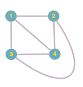

### Ruxandra Icleanu, s2011447@.ed.ac.uk

The most recent version of this is can be found [here](https://github.com/ruxicl/plfa.github.io/tree/tspl-project/courses/TSPL/2023/Essay).


```
module project.planarity where
  import Relation.Binary.PropositionalEquality as Eq
  open Eq using (_≡_; refl; sym; trans; cong; _≢_)
  open import Relation.Binary.Definitions using (DecidableEquality)
  
  open import Data.Nat using (ℕ; _≟_; _≥_)
  
  open import Data.List using (List; _∷_; []; _++_)
  open import Data.List.Base using (length)
  open import Data.List.Relation.Unary.Any using (Any; here; there)
  open import Data.List.Membership.Propositional using (_∈_)
  open import Data.String using (String)
  open import Relation.Nullary using (¬_; Dec; yes; no)
  open import Data.Product
    using (_×_; proj₁; proj₂; ∃; ∃-syntax)
    renaming (_,_ to ⟨_,_⟩)
  
```

## Introduction

A planar graph is a graph that can be drawn in the plane without any
crossings, that is no two edges intersect except at a vertex they are
incident with. We call such a drawing a plane drawing. [3]

For example, the complete graph (i.e. the graph in which any two vertices
are connected) with 4 vertices (known as K₄) can be drawn in the plane in
multiple ways:




We note that only the second drawing is a plane drawing. Since K₄ has a plane drawing,
it must be a planar graph.

In what follows, we want to develop a definition of planar graphs based on [1]
"Formalization of Planar graphs" by H. Yamamoto et. al (with substantial changes -
the paper uses HOL, a higher-order logic theorem proving system). The approach
we will consider is based on the key observation that (as it will be explained later,
a very wide class of) planar graphs can be constructed in an inductive fashion starting
from a cycle which is clearly planar, and carefully adding sequences of edges.

We also briefly discuss other approaches. 

To show the validity of our definition, we want to prove Euler's formula.


## Preliminaries

We will restrict our attention to a specific (but common) type of graphs, namely
2-connected graphs, i.e. graphs that remain connected after the removal of any one vertex.

The following theorem from [4] proves that esthablishing a criterion for this type of graph will immediately lead to a criterion for a general graph.

Theorem: A graph is planar if and only if its 2-connected (or biconnected) components are planar.

We will assume that any graph mentioned from now on is 2-connected, unless otherwise specified.


## Cycles
We first develop a theory of cycles. This will be useful for the inductive definition of planar ggraphs that we will introduce later.

We encode vertices simply as natural numbers, edges as lists of pairs of vertices and a cycle as a list of edges - we note that we have not formalised what a graph is yet, so in what follows we think of cycles as circular lists.

```agda
  pattern [_] z = z ∷ []
  pattern [_,_] y z = y ∷ z ∷ []
  pattern [_,_,_] x y z = x ∷ y ∷ z ∷ []
```

First, we define a predicate `isCycle`. Given a list of edges, we identify two cases:
- the base case: creating a self-loop (drawing an edge from a vertex to itself) is a cycle
- the inductive case: given a cycle and a vertex `y` outside the cycle, the result of extending the cycle by removing the edge between two consecutive vertices `x` and `z` and drawing edges from `x` to `y` and from `y` to `z` is a cycle.

We need to define several helper functions before defining the mentioned predicate. First we define `deleteEdge` which searches for a specified edge and deletes it from the given list:

```agda
  deleteEdge : List (ℕ × ℕ) → (ℕ × ℕ) → List (ℕ × ℕ)
  deleteEdge [] _ = []
  deleteEdge (⟨ a , b ⟩ ∷ xs) ⟨ c , d ⟩ with a ≟ c | b ≟ d
  ... | yes _ | yes _ = deleteEdge xs ⟨ c , d ⟩
  ... | _     | _     = ⟨ a , b ⟩ ∷ deleteEdge xs ⟨ c , d ⟩
```

For example, for a self-loop of the vertex 1, deleting the unique edge 1-1 results in an empty cycle. Trying to delete an unexistent edge should result in the same cycle.

```agda
  _ : deleteEdge [ ⟨ 1 , 1 ⟩ ] ⟨ 1 , 1 ⟩ ≡ []
  _ = refl

  _ : deleteEdge [ ⟨ 1 , 1 ⟩ ] ⟨ 1 , 2 ⟩ ≡ [ ⟨ 1 , 1 ⟩ ]
  _ = refl
```

We also need to define a function that lists the elements of a cycle - we note that later we willdefine a version of this function that enforces that the given list is indeed a cycle before proceeding to list its elements.

```agda
  listElem : List (ℕ × ℕ) → List ℕ
  listElem [] = []
  listElem (⟨ a , b ⟩ ∷ xs) = a ∷ listElem xs

```

We also need a cycle that ensures that a given vertex is not part of a cycle.

```agda
  isVertexNotInCycle : ℕ → List ℕ → Set
  isVertexNotInCycle v elemOfCycle = ¬ (v ∈ elemOfCycle)
```

Finally, we can define the predicate `isCycle` 

```agda
  data isCycle : List (ℕ × ℕ)  → Set where
    self-loop : ∀ (x : ℕ) → isCycle [ ⟨ x , x ⟩ ]
    insert-vertex : ∀ (x y z : ℕ) (s : List (ℕ × ℕ))
      → isCycle s
      → ⟨ x , z ⟩ ∈ s
      → isVertexNotInCycle y (listElem s)
      → isCycle (deleteEdge s ⟨ x , z ⟩ ++ [ ⟨ x , y ⟩ , ⟨ y , z ⟩ ])
```

and a datatype `Cycle` that uses `isCycle` as its characteristic predicate.

```agda
  data Cycle : Set where
    makeCycle : (c : List (ℕ × ℕ)) → isCycle c → Cycle
```

Now we can define the functions that will be building blocks for our inductive definition.

```agda
  cycleElem : Cycle → List ℕ
  cycleElem (makeCycle c cIsCycle) = getElem c
    where
      getElem : List (ℕ × ℕ) → List ℕ
      getElem [] = []
      getElem (⟨ a , b ⟩ ∷ xs) = a ∷ getElem xs
```

```agda
  nextElem : (cycle : Cycle) → (x : ℕ) → ℕ
  nextElem (makeCycle c cIsCycle) x  = findElem c x
    where
      findElem : List (ℕ × ℕ) → ℕ → ℕ
      findElem [] x = 0
      findElem (⟨ a , b ⟩ ∷ xs) x with a ≟ x
      ... | yes _ = b
      ... | no  _ = findElem xs x
```

```agda
  extractEdgeSet : Cycle → List (ℕ × ℕ)
  extractEdgeSet (makeCycle c cIsCycle) = c
```

We now consider two examples to ensure we correctly specified the definitions.

```agda
  cycle1 : Cycle
  cycle1 = makeCycle [ ⟨ 2 , 2 ⟩ ] (self-loop 2)

  notInCycle2 : isVertexNotInCycle 2 [ 1 ]
  notInCycle2 (here ())
  notInCycle2 (there ())
  
  cycle2IsCycle : isCycle [ ⟨ 1 , 2 ⟩ , ⟨ 2 , 1 ⟩ ]
  cycle2IsCycle = insert-vertex 1 2 1 [ ⟨ 1 , 1 ⟩ ] (self-loop 1)
                                  ( here (refl { A = ℕ × ℕ }) ) (notInCycle2)

  cycle2 : Cycle
  cycle2 = makeCycle [ ⟨ 1 , 2 ⟩ , ⟨ 2 , 1 ⟩ ] cycle2IsCycle

  _ : cycleElem cycle1 ≡ [ 2 ]
  _ = refl

  _ : nextElem cycle1 2 ≡ 2
  _ = refl

  _ : cycleElem cycle2 ≡ [ 1 , 2 ]
  _ = refl
```

We define two cycles to be equal if they have the same set of vertices and the same edges.

## Inductive definition
  Our goal is to define a predicate `isPlanar` that holds exactly for planar graphs. As we saw in the introduction, a planar graph need not have only plane drawings (more precisely, a planar graph can always be drawn in a non-planar way) - but it is enough to find a plane drawing for the graph to be planar.

Thus, it is useful to define a plane drawing instead of a graph - that is, in addition to the set set of edges and set of vertices, we will also specify the set of regions (or faces) and the designated outer region.

```agda
  record GraphDrawing : Set where
    constructor graph
    field
      vertices : List ℕ
      edges : List (ℕ × ℕ)
      regions : List Cycle
      outerRegion : Cycle
      

  -- need to update the ind-step
  data isPlanar : GraphDrawing → Set where
    base-case : ∀ (c : Cycle) → isPlanar (graph (cycleElem c) (extractEdgeSet c) [ c ] c)
    ind-step  : ∀ (g : GraphDrawing) (c : Cycle)
      → isPlanar g
      → length (cycleElem c) ≥ 2
      → isPlanar (graph (cycleElem c) (extractEdgeSet c) [ c ] c)
```

Let's unpack the definition:

## Euler's formula

## Other approaches

[2] presents a very different approach: using homotopy type theory, it is possible to define
an embedding of graphs into surfaces.

### UniMath library

## Future work

The most recent version of this is can be found [here](https://github.com/ruxicl/plfa.github.io/tree/tspl-project/courses/TSPL/2023/Essay).

To do:
- vertices have type `ℕ`, but might want to change to `String` (or a more generic type `A`)
- it might be better to use Setoids instead of Lists for edges and vertices
- finish ind-step
- prove Euler's formula


## References

[1] Formalization of Planar Graphs - Mitsuharu Yamamoto, Shin-ya Nishizaki, Masami Hagiya, and Yozo Toda

[2] On Planarity of Graphs in Homotopy Type Theory - Jonathan Prieto-Cubides, Hakon Robbestad Gylterud

[3] Introduction to graph theory (5th edition) - Robin J. Wilson

[4] J. E. Hopcroft and R. E. Tarjan. Efficient planarity testing. J. ACM, 21(4):549–568, 1974.
