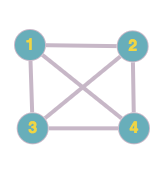

-- Ruxandra Icleanu, s2011447@.ed.ac.uk


To do:
- do a readme of how to make this work
- see this https://unimath.github.io/agda-unimath/graph-theory.polygons.html - seems easy to contribute to this


```agda
module project.planarity where
  import Relation.Binary.PropositionalEquality as Eq
  open Eq using (_≡_; refl; sym; trans; cong; _≢_)

  open import Data.Nat using (ℕ; _≟_)
  open import Data.List using (List; _∷_; []; _++_)
  -- open import plfa.part1.Lists using (List; _∷_; []; _++_; _∈_; _∉_)
  open import Data.List.Relation.Unary.Any using (Any; here; there)
  
  open import Data.List.Membership.Propositional using (_∈_)
  
  open import Data.String using (String)
  open import Relation.Nullary using (¬_; Dec; yes; no)
  open import Data.Product
    using (_×_; proj₁; proj₂; ∃; ∃-syntax)
    renaming (_,_ to ⟨_,_⟩)

  open import Data.Fin.Base using (Fin)

  open import Relation.Binary.Definitions using (DecidableEquality)
  
  -- open import foundation-core.identity-types using (Id)
  -- open import graph-theory.directed-graphs using (Directed-Graph)
  -- open import graph-theory.polygons using (Polygon)
  -- open import foundation.dependent-pair-types using (Σ)

  -- {-# BUILTIN LIST List #-}
```

## Introduction

A planar graph is a graph that can be drawn in the plane without any
crossings, that is no two edges intersect except at a vertex they are
incident with. We call such a drawing a plane drawing.

For example, the complete graph with 4 vertices (known as K₄) can be
drawn in the plane in multiple ways:



The second drawing is a plane drawing, and so K₄ is a planar graph.

We consider two approaches of formalising planarity. The first approach
is based on the idea that planar graphs can be constructed in an
inductive fashion starting from a cycle (which is clearly planar) and
carefully adding sequences of edges. The second approach is to use
homotopy type theory to define an embedding of graph into surfaces.

To show the validity of our definition, we prove Euler's formula and
derive a simple lemma.


Notes:
- we make use of the library unimath but
- contribution to the library?
-


## Libraries

unimath

[description]
- was used in both approaches
- contribution to the library


## Inductive definition

This section is based on "Formalization of Planar graphs" by H. Yamamoto
et. al [2], with substantial changes (the original paper uses HOL to
formalise).

[you need to state some definitions here]

Theorem: A graph is planar if and only if its 2-connected components
are planar.

So we can restrict our attention only to 2-connected graphs.


### Circular lists
We first develop a theory of circular lists.

In a circular list, the k-th element comes prior to the (k+1)-th
element, and the last element comes before the first one.

We define a circular list as a special case of a directed graph,
as follows:
  the set of elements of the list is equal to the set of vertices
  of the graph
  element x comes prior to element y in the list if and only if
  there is a directed edge from the vertex x to the vertex y in
  the graph

In Agda:

```agda
  pattern [_] z = z ∷ []
  pattern [_,_] y z = y ∷ z ∷ []
  pattern [_,_,_] x y z = x ∷ y ∷ z ∷ []
```

-- goal: define a circular list

  ```agda

  -- right now type Vertex = ℕ, but might want to change to string or something even more generic

  deleteEdge : List (ℕ × ℕ) → (ℕ × ℕ) → List (ℕ × ℕ)
  deleteEdge [] _ = []
  deleteEdge (⟨ a , b ⟩ ∷ xs) ⟨ c , d ⟩ with a ≟ c | b ≟ d
  ... | yes _ | yes _ = deleteEdge xs ⟨ c , d ⟩
  ... | _     | _     = ⟨ a , b ⟩ ∷ deleteEdge xs ⟨ c , d ⟩

  _ : deleteEdge [ ⟨ 1 , 1 ⟩ ] ⟨ 1 , 1 ⟩ ≡ []
  _ = refl

  _ : deleteEdge [ ⟨ 1 , 1 ⟩ ] ⟨ 1 , 2 ⟩ ≡ [ ⟨ 1 , 1 ⟩ ]
  _ = refl

  -- it's sufficient to check if v appears in the first component

  -- can you add condition that cycle is indeed cycle? or

  -- isVertexNotInCycle : ℕ → List (ℕ × ℕ) → Set
  -- isVertexNotInCycle v cycle = (w : ℕ) → ¬ (⟨ v , w ⟩ ∈ cycle)

  isVertexNotInCycle : ℕ → List ℕ → Set
  isVertexNotInCycle v elemOfCycle = ¬ (v ∈ elemOfCycle)

  -- a cycle is a list of pairs representing edges

  data isCycle : List (ℕ × ℕ)  → Set where
    self-loop : ∀ (x : ℕ) → isCycle [ ⟨ x , x ⟩ ]
    add-vertex : ∀ (x y z : ℕ) (s : List (ℕ × ℕ))
      → isCycle s
      → ⟨ x , z ⟩ ∈ s
      → isVertexNotInCycle y [ 1 ]
      → isCycle (deleteEdge s ⟨ x , z ⟩ ++ [ ⟨ x , y ⟩ , ⟨ y , z ⟩ ])

-- we represent them as lists but the order should not matter? or it matters but they should be circular
-- alternatives: finite sets, partial maps (see sltc chapter from Software Foundations)
    
  ```

We can prove the validty of the following cycle [insert picture]
Since we can construct it. This is similar to the story of creation of naturals.

From a given set of vertices, we get the following.

We need to equality in a smart way so [⟨ 1 , 2 ⟩ , ⟨ 2 , 3 ⟩ , ⟨ 3 , 1 ⟩ ] is equal to
[ ⟨ 2 , 3 ⟩ , ⟨ 3 , 1 ⟩ , ⟨ 1 , 2⟩ ]


-- we could define edges as functions instead of pairs
-- see ex. from Lambda "show that Context is isomorphic to List (Id × Type)"


```agda

  _ : [] ++ [ 1 ] ≡ [ 1 ]
  _ = refl

  _ : [] ≡ []
  _ = refl { A = List (ℕ × ℕ) }

```

```agda
  _ : isCycle [ ⟨ 1 , 1 ⟩ ]
  _ = (self-loop 1)

  _ : deleteEdge [ ⟨ 1 , 1 ⟩ ] ⟨ 1 , 1 ⟩ ≡ []
  _ = refl

  -- need to define equality for sigma types _≟Σ_

  _ : [ 1 ] ++ [ 2 , 3 ] ≡ [ 1 , 2 , 3 ]
  _ = refl

  _ : [ ⟨ 1 , 2 ⟩ ] ++ [ ⟨ 2 , 4 ⟩  ] ≡  [ ⟨ 1 , 2 ⟩ , ⟨ 2 , 4 ⟩ ]
  _ = refl { A = List (ℕ × ℕ) }

  _ :  [ ⟨ 1 , 2 ⟩ ] ≡ [ ⟨ 1 , 2 ⟩ ]
  _ = refl { A = List (ℕ × ℕ) }

  _ : 1 ∈ [ 1 , 2 ]
  _ = here refl

  -- _∈-×_ : ∀ {A : Set} (x : A) (xs : List A) → Set
  -- x ∈ xs = Any (x ≡_ {A = List (ℕ × ℕ)}) xs

  _ :  ⟨ 1 , 1 ⟩ ∈ [ ⟨ 1 , 1 ⟩ ]
  _ = here (refl { A = ℕ × ℕ })

  not-in : isVertexNotInCycle 2  [ 1 ]
  not-in (here ())
  not-in (there ())
  
  
  _ : isCycle [ ⟨ 1 , 2 ⟩ , ⟨ 2 , 1 ⟩ ]
  _ = add-vertex 1 2 1 [ ⟨ 1 , 1 ⟩ ] (self-loop 1) ( here (refl { A = ℕ × ℕ }) ) (not-in)
```


- discussion about how to define equality of different structures

- define face
- define infinite face - note: any face can choosen to be the infinite face

We define a plane drawing of a graph to be a quadruple: the set of vertices, the set of edges, the set of faces, and the infinite face

We f
 

```agda
{-
  record Graph : Set₁ where
    field
      vertices : Set
      edges : Set
-}
```

```agda
{-
  record PlaneDrawing : Set₁ where
    field
      vertices : Set
      edges : Set
      faces : Set
      infiniteFace : Set
-}
```

We define a face to be a circular (cyclic) list of vertices.

We define a predicate as following

```agda
  -- data isPlanar : ∀ (G : PlaneDrawing) → Set
  -- isPlanar G record {vertices = vertices; edges = edges; faces = faces; infiniteFace = infiniteFace } = 
```


## Topological graph theory
This section is based on "Planar graphs in Homotopy type theory" - J. Prieto-Cuibides

Simple and undirected graphs


We define two predicates.

-- these def are from the Hott book


```agda
{-

  -- there is a unique term of type A
  isProp : ∀ (A : Set) → Set
  -- unimath uses Id instead of ≡
  isProp A = (x y : A) → (Id x y)

  -- two elements of a set are equal in just one way
  isSet : ∀ (A : Set) → Set
  isSet A = {x y : A} (p q : Id x y) → (Id p q)
-}
```

```agda
  -- data vs record - which one to use?
{-
  record Graph′ : Set₁ where
    field
      vertex : Set
      edge : vertex → vertex → Set
      vertices-form-set : (isSet vertex)
      no-multiple-edges : (x y : vertex) → isProp (edge x y)
      undirected-edges : (x y : vertex) → (edge x y)
-}
```

```agda
  data ClassicSet : List (ℕ × ℕ)
    

  {--
  data isCycle : List (ℕ × ℕ)  → Set where
    self-loop : ∀ (x : ℕ) → isCycle [ ⟨ x , x ⟩ ]
    add-vertex : ∀ (x y z : ℕ) (s : List (ℕ × ℕ))
      → isCycle s
      → ⟨ x , z ⟩ ∈ s
      → isVertexNotInCycle y [ 1 ]
      → isCycle (deleteEdge s ⟨ x , z ⟩ ++ [ ⟨ x , y ⟩ , ⟨ y , z ⟩ ])
  --}

```


## References
[1] On Planarity of Graphs in Homotopy Type Theory - JONATHAN PRIETO-CUBIDES, HÅKON ROBBESTAD GYLTERUD
[2] Formalization of Planar Graphs - Mitsuharu Yamamoto, Shin-ya Nishizaki, Masami Hagiya, and Yozo Toda
[3] Introduction to graph theory (5th edition) - Robin J. Wilson
[4] 
